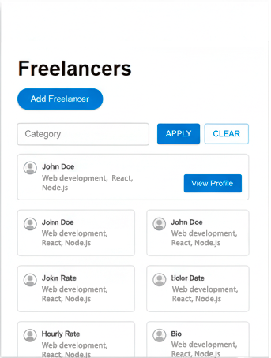
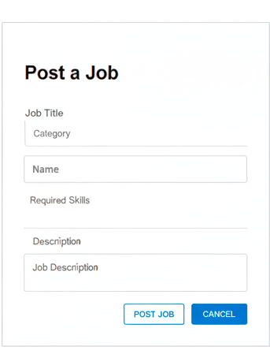

# Содержание
1 [Введение](#intro)   
1.1 [Назначение документа](#purpose)   
1.2 [Бизнес-требования](#business_needs)   
1.2.1 [Начальные условия](#starting_conditions)   
1.2.2 [Коммерческие возможности](#commercial_prospects)   
1.2.3 [Ограничения проекта](#project_scope)   
1.3 [Аналоги и конкуренты](#competitors)   
2 [Требования пользователя](#user_needs)   
2.1 [Программные интерфейсы](#software_connections)   
2.2 [Интерфейс пользователя](#user_experience)   
2.3 [Профиль пользователей](#user_profile)   
2.3.1 [Категории пользователей](#user_categories)   
2.3.2 [Целевая аудитория](#target_group)   
2.3.2.1 [Основная аудитория](#primary_audience)   
2.3.2.2 [Дополнительная аудитория](#secondary_audience)   
2.4 [Предположения и зависимости](#dependencies)   
3 [Технические требования](#technical_specs)   
3.1 [Функциональные требования](#functional_specs)   
3.1.1 [Основные возможности](#core_features)   
3.1.1.1 [Доступ к приложению](#app_access)   
3.1.1.2 [Настройка профиля пользователя](#profile_setup)   
3.1.1.3 [Загрузка списка фрилансеров](#freelancer_list_load)   
3.1.1.4 [Просмотр данных о фрилансере](#freelancer_details)   
3.1.1.5 [Выход из системы](#logout)   
3.1.1.6 [Регистрация нового пользователя](#new_user_registration)   
3.1.2 [Ограничения и исключения](#limitations)   
3.2 [Нефункциональные требования](#nonfunctional_specs)   
3.2.1 [Характеристики качества](#quality_traits)   
3.2.1.1 [Удобство использования](#usability)     
3.2.1.2 [Требования к безопасности](#security)   
3.2.1.3 [Доступность](#availability)   
3.2.2 [Внешние интерфейсы](#external_links)   
3.2.3 [Ограничения системы](#system_constraints)   

<a name="intro"/> 

# 1 Введение 

<a name="purpose"/> 

## 1.1 Назначение документа 
Этот документ содержит описание функциональных и нефункциональных требований к веб-приложению «Freelance Marketplace». Он предназначен для разработчиков и тестировщиков, участвующих в создании и проверке системы.

<a name="business_needs"/> 

## 1.2 Бизнес-требования 

<a name="starting_conditions"/> 

### 1.2.1 Начальные условия 
Многие люди ищут специалистов для выполнения задач, а фрилансеры стремятся предложить свои услуги. Часто возникает необходимость в удобной платформе для поиска исполнителей и управления проектами. Хотя существуют сервисы вроде Upwork, они требуют регистрации и могут быть перегружены функциями для простых задач.

<a name="commercial_prospects"/> 

### 1.2.2 Коммерческие возможности 
Приложение может привлечь пользователей, желающих быстро находить фрилансеров, фильтровать их по навыкам и управлять заказами без сложных настроек. Интуитивный дизайн и оффлайн-доступ увеличат популярность среди широкой аудитории, включая людей разного возраста.

<a name="project_scope"/> 

### 1.2.3 Ограничения проекта 
«Freelance Marketplace» предоставляет пользователям возможность просматривать данные о фрилансерах и управлять заказами. Гости могут только просматривать информацию, в то время как в будущем планируется добавить функции общения и оплаты.

<a name="competitors"/> 

## 1.3 Аналоги и конкуренты 
Среди аналогов можно выделить Upwork, Fiverr и Freelancer.com. Эти платформы позволяют искать специалистов, читать отзывы и организовывать проекты. Однако их сложность и обязательная регистрация могут отпугнуть пользователей, нуждающихся в простом решении.

<a name="user_needs"/> 

# 2 Требования пользователя 

<a name="software_connections"/> 

## 2.1 Программные интерфейсы 
Приложение использует PostgreSQL для хранения данных и Docker для контейнеризации.

<a name="user_experience"/> 

## 2.2 Интерфейс пользователя 
Список фрилансеров.   

   

Подробности фрилансера.   

   

Форма добавления/редактирования фрилансера.   

   

Форма добавления заказа.   

   

Форма добавления навыка.   

   

Панель фильтрации.   

   

<a name="user_profile"/> 

## 2.3 Профиль пользователей 

<a name="user_categories"/> 

### 2.3.1 Категории пользователей 

| Категория пользователей | Описание | 
|:---|:---| 
| Админ | Пользователи с полным доступом к управлению фрилансерами, заказами и навыками. |
| Гость | Пользователи с доступом к просмотру фрилансеров, заказов, без возможности создать заказ без необходимости авторизации. |
| Фрилансер | Пользователи с доступом к своему профилю в качестве фрилансера. | 
| Заказчик | Пользователи с доступом к своему профилю в качестве заказчика. | 

<a name="target_group"/> 

### 2.3.2 Целевая аудитория 

<a name="primary_audience"/> 

#### 2.3.2.1 Основная аудитория 
Лица, ищущие фрилансеров для выполнения различных проектов, а также сами фрилансеры.

<a name="secondary_audience"/> 

#### 2.3.2.2 Дополнительная аудитория 
Люди, интересующиеся не только фриланс-услугами, но и другими сферами.

<a name="dependencies"/> 

## 2.4 Предположения и зависимости 
1. Система полагается на доступ к удалённой базе данных.
2. Система представляет собой веб-сервис, так что для работы необходим браузер и интернет подключение.

<a name="technical_specs"/> 

# 3 Технические требования 

<a name="functional_specs"/> 

## 3.1 Функциональные требования 

<a name="core_features"/> 

### 3.1.1 Основные возможности 

<a name="app_access"/> 

#### 3.1.1.1 Доступ к приложению 
**Описание.** Пользователь может начать работу с приложением без создания профиля. 

| Возможность | Требования |  
|:---|:---| 
| Доступ без профиля | Система должна обеспечить анонимный вход. |
| Доступ с профилем | Система должна обеспечить сохранность личных данных. | 

<a name="profile_setup"/> 

#### 3.1.1.2 Настройка профиля пользователя 
**Описание.** Пользователь может редактировать свои данные. 
  
| Возможность | Требования |  
|:---|:---| 
| Добавление/редактирование навыка/заказа | Система должна предложить форму для ввода/вывода информации о навыке/заказе. | 
| Удаление навыка/заказа | Пользователь может выбрать навыка/заказ и удалить его из списка. |
| Редактирование личных данных | Система должна предложить форму для редактирования портфолио, имени, контактных данных. | 

<a name="freelancer_list_load"/> 

#### 3.1.1.3 Загрузка списка фрилансеров 
**Описание.** После входа приложение загружает список фрилансеров, отсортированный по имени. 
 
| Возможность | Требования |  
|:---|:---| 
| Загрузка данных | Приложение должно отобразить список фрилансеров при запуске или изменении данных. | 

<a name="freelancer_details"/> 

#### 3.1.1.4 Просмотр данных о фрилансере 
**Описание.** Пользователь может изучить информацию о выбранном фрилансере. 
 
| Возможность | Требования |  
|:---|:---| 
| Просмотр деталей | Пользователь выбирает фрилансера, и система открывает окно с данными, включая заказы и навыки. | 

<a name="logout"/> 

#### 3.1.1.5 Выход из системы 
**Описание.** Пользователь может завершить сеанс работы. 

| Возможность | Требования |  
|:---|:---| 
| Выход | Система должна позволить пользователю выйти из аккаунта, возвращаясь к главной странице. |   

<a name="new_user_registration"/> 

#### 3.1.1.6 Регистрация нового пользователя 
**Описание.** Пользователь может создать аккаунт в приложении. 
 
**Требование.** Система должна предоставить опцию регистрации для новых пользователей.  

<a name="limitations"/> 

### 3.1.2 Ограничения и исключения 
1. Работа возможна только при подключении к базе данных.
2. Данные о фрилансерах доступны только из существующей базы.

<a name="nonfunctional_specs"/> 

## 3.2 Нефункциональные требования 

<a name="quality_traits"/> 

### 3.2.1 Характеристики качества 

<a name="usability"/> 

#### 3.2.1.1 Удобство использования 
1. Все ключевые функции доступны и работают корректно. 
2. Элементы интерфейса имеют понятные названия, отражающие их функции. 
3. Интерфейс минималистичен, без избыточных деталей.

<a name="security"/> 

#### 3.2.1.2 Требования к безопасности 
1. Доступ к данным ограничен текущим пользователем.

<a name="availability"/> 

#### 3.2.1.3 Доступность 
Реакция на действия пользователя должна быть быстрой.

<a name="external_links"/> 

### 3.2.2 Внешние интерфейсы 
Интерфейс приложения удобен: 
  * шрифт читаем и не слишком мелкий;  
  * дизайн соответствует [стандартам Material UI](https://material-ui.com).

<a name="system_constraints"/> 

### 3.2.3 Ограничения системы 
1. Приложение разработано для веб-платформы; 
2. Используются языки Java и JavaScript. 