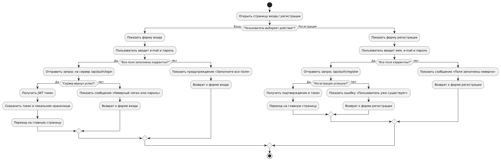
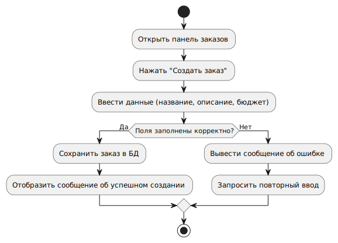
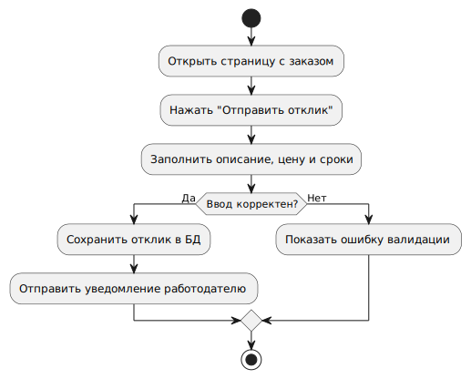
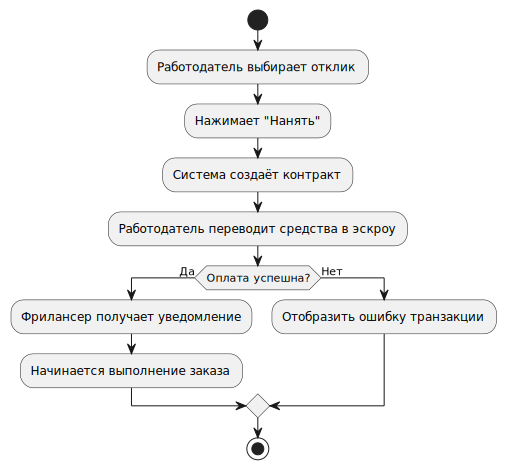

# Диаграммы активностей    

# Содержание
1. [Вход/регистрация в учётную запись](#1)
2. [Найм и оплата](#2)
3. [Отправка отклика фрилансера](#3)
4. [Найм фрилансера и оплата](#4)

### 1. [Вход/регистрация в учётную запись](https://github.com/Argentime/SDLC/tree/main/docs/diagrams/images/ActivityDiagramSignIn.svg)

### 2. [Размещение задания](https://github.com/Argentime/SDLC/tree/main/docs/diagrams/images/ActivityDiagramPostJob.svg)

### 3. [Отправка отклика фрилансера](https://github.com/Argentime/SDLC/tree/main/docs/diagrams/images/ActivitySubmit.svg)

   
### 4. [Найм фрилансера и оплата](https://github.com/Argentime/SDLC/tree/main/docs/diagrams/images/ActivityDiagramHireFreelancer.svg)

