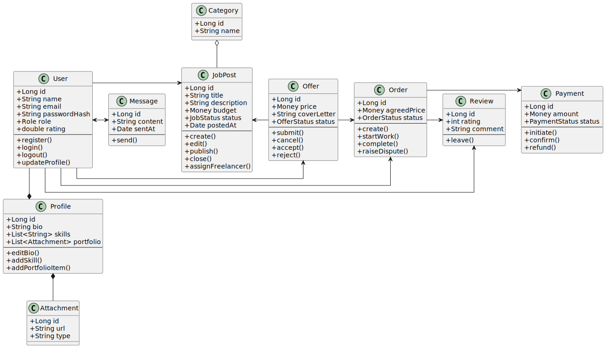

# [Диаграмма классов](https://github.com/Argentime/SDLC/tree/main/docs/diagrams/images/ClassDiagram.svg)  

# Глоссарий

| **Term**                                                  | **Description**                                                                                                                             |
| --------------------------------------------------------- | ------------------------------------------------------------------------------------------------------------------------------------------- |
| **User**                                                  | Основная сущность системы, представляющая зарегистрированного участника. Может иметь роль *Client*, *Freelancer* или *Admin*.               |
| **Role**                                                  | Роль пользователя в системе. Определяет права и доступные действия.                                                                         |
| **Profile**                                               | Расширенная информация о пользователе — биография, навыки, портфолио. Связан 1:1 с User.                                                    |
| **JobPost**                                               | Объявление о проекте, созданное клиентом. Содержит описание, категорию, бюджет и статус (DRAFT, OPEN, ASSIGNED и т.д.).                     |
| **Offer (Proposal)**                                      | Предложение фрилансера выполнить работу по конкретному JobPost. Имеет цену, сопроводительное письмо и статус (PENDING, ACCEPTED, REJECTED). |
| **Order**                                                 | Контракт, создающийся после принятия предложения. Связывает клиента и фрилансера, отслеживает процесс выполнения и оплаты.                  |
| **Payment**                                               | Запись о платеже, совершаемом в рамках заказа (Order). Может иметь статусы PENDING, PAID, REFUNDED, FAILED.                                 |
| **Review**                                                | Отзыв клиента или фрилансера после завершения заказа. Содержит рейтинг и комментарий.                                                       |
| **Message**                                               | Сообщение между пользователями в чате. Может относиться к JobPost, Offer или Order.                                                         |
| **Category**                                              | Тематическая категория задания (например, Web Development, Design, Writing).                                                                |
| **Attachment**                                            | Загружаемый файл (резюме, портфолио, пример работы, приложение к заказу).                                                                   |
| **Money**                                                 | Вспомогательный тип, обозначающий денежное значение (с валютой).                                                                            |
| **JobStatus / OfferStatus / OrderStatus / PaymentStatus** | Перечисления (enum), задающие возможные состояния соответствующих сущностей.                                                                |
